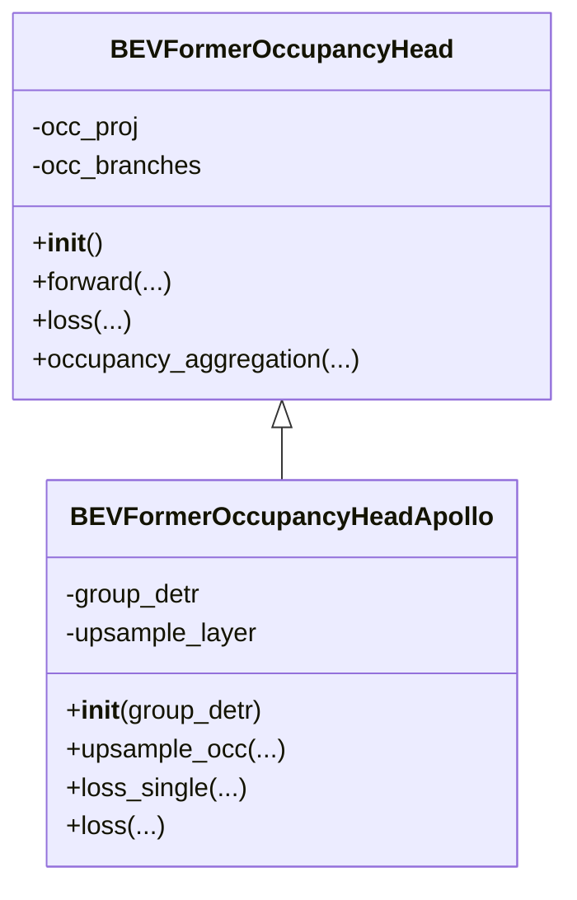

> 本文基于 ApolloAuto 的 **Apollo-Vision-Net** 工程，整理一个“BEVFormer 做 3D 目标检测 + OCC 占据栅格预测”的多任务模型实现与训练配置。  
> 重点不是复述论文，而是把工程里真正跑起来的 **配置 → Head → 前向 → 多任务损失** 串起来，并把关键实现“钉”在源码行号上，方便你二次改造。

---
原代码地址：[https://github.com/ApolloAuto/Apollo-Vision-Net](https://github.com/ApolloAuto/Apollo-Vision-Net)
## 1. 任务定义与输出

这个工程的多任务输出主要包含两类：

- **3D 目标检测（DETR 风格）**
  - 输出：每一层 decoder 的分类 logits 与 bbox 回归
  - 关键点：query-based、Hungarian assigner、无 NMS（`NMSFreeCoder`）
- **OCC 占据栅格预测**
  - 输出：每个 voxel 的语义类别（以及可选的 voxel flow）
  - 关键点：BEV token（或时序 BEV token）→ 体素网格（x,y,z）→ 分类

此外，它还支持 temporal（`queue_length`）：

- **det 通常只监督当前帧（t）**
- **occ 可以监督序列多帧（t-2,t-1,t）**：工程里会把 `prev_bev` 列表拼成 `seq_len`，对 occlusion/flow 类任务更友好

为了后面读代码不迷路，先给你一个“高层数据流”的示意（关键张量）：


下面几节会分别证明：**det 主要依赖 decoder 的 query；occ 基本不走 decoder，而是把 BEV token reshape/upsample 到 voxel 网格**。

---

## 2. 从配置开始：这个多任务模型到底长什么样？

### 2.1 训练配置总览（配置文件）

**文件：**`projects/configs/bevformer/bev_tiny_det_occ_apollo.py`（约 L1–L287）

关键配置点：

- BEV 尺寸与时序长度  
  - `bev_h_=50, bev_w_=50`  
  - `queue_length=3`（每个 sample 是一个长度为 3 的序列）
- 多任务 Head：`BEVFormerOccupancyHeadApollo`
- Transformer（Encoder: TSA + SCA；Decoder: detection queries）
- Loss：det 的 focal/l1；occ 的 focal + affinity（可扩展到 lovasz/scale）

---

### 2.2 关键配置片段（原样引用）

#### 2.2.1 模型与 Head 入口（`model=dict(...)`）

**文件：**`projects/configs/bevformer/bev_tiny_det_occ_apollo.py`（L33–L131）

```python
bev_h_ = 50
bev_w_ = 50
queue_length = 3 # each sequence contains `queue_length` frames.
group_detr = 11

model = dict(
    type='BEVFormer',
    use_grid_mask=True,
    video_test_mode=True,
    use_occ_gts=True,
    only_occ=False,
    only_det=False,
    pretrained=dict(img='ckpts/depth_pretrained_dla34-y1urdmir-20210422_165446-model_final-remapped_bev.pth'),
    ...
    pts_bbox_head=dict(
        type='BEVFormerOccupancyHeadApollo',
        group_detr=group_detr,
        bev_h=bev_h_,
        bev_w=bev_w_,
        num_query=900,
        ...
        occupancy_size=occupancy_size,
        occ_dims=_occupancy_dim_,
        occupancy_classes=16,
        transformer=dict(
            type='PerceptionTransformer',
            rotate_prev_bev=True,
            use_shift=True,
            use_can_bus=True,
            embed_dims=_dim_,
            encoder=dict(
                type='BEVFormerEncoder',
                num_layers=3,
                ...
                transformerlayers=dict(
                    type='BEVFormerLayer',
                    attn_cfgs=[
                        dict(type='TemporalSelfAttention', embed_dims=_dim_, num_levels=1),
                        dict(type='SpatialCrossAttention', ...)
                    ],
                    operation_order=('self_attn', 'norm', 'cross_attn', 'norm', 'ffn', 'norm'))),
            decoder=dict(
                type='DetectionTransformerDecoder',
                num_layers=6,
                return_intermediate=True,
                transformerlayers=dict(
                    type='DetrTransformerDecoderLayer',
                    attn_cfgs=[
                        dict(type='GroupMultiheadAttention', group=group_detr, embed_dims=_dim_, num_heads=8, dropout=0.1),
                        dict(type='CustomMSDeformableAttention', embed_dims=_dim_, num_levels=1),
                    ],
                    operation_order=('self_attn', 'norm', 'cross_attn', 'norm', 'ffn', 'norm')))),
        ...
        loss_cls=dict(type='FocalLoss', ...),
        loss_bbox=dict(type='L1Loss', loss_weight=0.25),
        ...
        loss_occupancy=dict(type='FocalLoss', ...),
        loss_affinity=dict(
            type='affinity_loss',
            loss_voxel_sem_scal_weight=1.0,
            loss_voxel_geo_scal_weight=0.0)
    ),
    train_cfg=dict(pts=dict(
        ...
        assigner=dict(type='HungarianAssigner3D', ...))))
```

该配置有三个结构特征：

1) det 与 occ 共用同一个 BEV 表示（`bev_embed / bev_for_occ`），只是后面分支不同  
2) detection 的 decoder 是 “query → BEV” 的注意力；occ 的预测不走 decoder（它从 BEV grid token 直接投影/上采样成 voxel）  
3) `group_detr` 会改变 query 数量与 loss 组织（Apollo 版本特有增强）

*图 1：模型结构示意*

#### 2.2.2 数据集的时序输入（queue_length=3）

**文件：**`projects/configs/bevformer/bev_tiny_det_occ_apollo.py`（L179–L221）

```python
data = dict(
    ...
    train=dict(
        type=dataset_type,
        ...
        bev_size=(bev_h_, bev_w_),
        queue_length=queue_length,
        box_type_3d='LiDAR'),
    ...
)
```

这里的 `queue_length=3` 是“数据侧语义”：一个训练样本里包含 3 帧的时序信息。  
但注意：Transformer(TSA) 内部通常只显式用 1 个 history BEV（t-1）；更多历史信息（t-2）在这个工程里主要会体现在 OCC 分支的 `seq_len` 监督（后面会用 head 代码证明）。

---

## 3. Head 设计：父类（通用多任务）vs. Apollo 子类（工程增强）

工程里把多任务 head 拆成两层：

- 父类：`BEVFormerOccupancyHead`（通用：det + occ/flow + 可选 occ cnn head）
- 子类：`BEVFormerOccupancyHeadApollo`（工程增强：group_detr、upsample+cascade、可选 occ_tsa、更丰富的 occ loss）

下面按“能跑的代码路径”来讲。

---

### 3.1类继承关系：父类/子类在哪里分工？


读图要点：

- **父类**负责“通用 det/occ 主干逻辑”（OCC 网格推导、BEV→voxel reshape、可选 flow aggregation）。
- **子类**在工程里加了“可训练更稳/更 dense”的增强（`group_detr`、CNN upsample OCC、更丰富的 loss）。

---

## 4. 父类 Head：BEVFormerOccupancyHead（多任务主干）

### 4.1 初始化：如何把 OCC 网格“算”出来？

**文件：**`projects/mmdet3d_plugin/bevformer/dense_heads/bevformer_occupancy_head.py`（L45–L124）

```python
self.occupancy_size = occupancy_size
self.point_cloud_range = point_cloud_range
self.occ_xdim = int((point_cloud_range[3] - point_cloud_range[0]) / occupancy_size[0])
self.occ_ydim = int((point_cloud_range[4] - point_cloud_range[1]) / occupancy_size[1])
self.occ_zdim = int((point_cloud_range[5] - point_cloud_range[2]) / occupancy_size[2])
...
self.voxel_num = self.occ_xdim*self.occ_ydim*self.occ_zdim
```

OCC 任务：`voxel_num = xdim*ydim*zdim`。

---

### 4.2 分支化：det 分支 vs. occ 分支在哪里开始分道扬镳？

**文件：**`projects/mmdet3d_plugin/bevformer/dense_heads/bevformer_occupancy_head.py`（L146–L252）

```python
if self.transformer.decoder is not None:
    ...
    if not self.as_two_stage:
        self.bev_embedding = nn.Embedding(self.bev_h * self.bev_w, self.embed_dims)
        self.query_embedding = nn.Embedding(self.num_query, self.embed_dims * 2)
else:
    self.bev_embedding = nn.Embedding(self.bev_h * self.bev_w, self.embed_dims)

if self.use_fine_occ:
    self.occ_proj = Linear(self.embed_dims, self.occ_dims * self.occ_zdim//2)
else:
    self.occ_proj = Linear(self.embed_dims, self.occ_dims * self.occ_zdim)

occ_branch = []
for _ in range(self.num_occ_fcs):
    occ_branch.append(Linear(self.occ_dims, self.occ_dims))
    occ_branch.append(nn.LayerNorm(self.occ_dims))
    occ_branch.append(nn.ReLU(inplace=True))
occ_branch.append(Linear(self.occ_dims, self.occupancy_classes))
self.occ_branches = nn.Sequential(*occ_branch)
```

---

### 4.2.1 配置到类的“装配图”：`bev_tiny_det_occ_apollo.py` 到底实例化了什么？

很多同学读 OpenMMLab 工程最卡的一点是：**配置文件里的 `type='xxx'` 最终到底 new 了哪个类？**

本文先用“概念装配图”把它串一下（不依赖每个 registry 细节，目的是帮你定位：哪一层负责哪件事）：


你可以把它当成“依赖注入图”：

- **Encoder/Decoder 属于 transformer（`PerceptionTransformer`）**
- **det 的输出主要来自 decoder**
- **occ 的输出主要来自 head 内的 BEV→voxel 分支**

#### 一点“shape 心智模型”（建议你在 debug 时对照打印）

工程里常见的几种关键 shape 关系，可以用这个小表先记住（不同配置会有差异，但逻辑相同）：

| 张量 | 典型 shape（概念） | 含义 |
|---|---|---|
| `bev_embed` / `bev_for_occ` | `(B, HW_bev, D)` 或 `(HW_bev, B, D)` | 2D BEV 网格 token（$H_{bev}\times W_{bev}$ 个） |
| `object_query_embeds` | `(num_query, D)`（推理时） | DETR queries（Apollo 会做 group 扩张） |
| `all_cls_scores` | `(num_layers, B, num_query, num_classes)` | 每层 decoder 的分类 |
| `all_bbox_preds` | `(num_layers, B, num_query, code_size)` | 每层 decoder 的 box 回归 |
| `occ_pred` | `(B*seq_len, Z*X*Y, occ_dims)` | voxel feature（后续接分类） |
| `occupancy_preds` | `(B*seq_len, Z*X*Y, occupancy_classes)` | voxel 分类 logits |

如果你只想快速验证“occ 是不是走 decoder”，一个实用的检查方式是：

- 同时打印 `all_cls_scores/all_bbox_preds`（det 输出）以及 `occupancy_preds`（occ 输出）的来源；你会发现 occ 是从 `bev_for_occ` reshape 或 upsample 来的，而不是从 decoder 输出里切出来的。

---

### 4.3 前向：`prev_bev` 列表如何变成 `seq_len`？

**文件：**`projects/mmdet3d_plugin/bevformer/dense_heads/bevformer_occupancy_head.py`（L304–L374）

```python
if isinstance(prev_bev, list) or isinstance(prev_bev, tuple):
    prev_bevs = [f.permute(1, 0, 2) for f in prev_bev]
    prev_bev = prev_bev[-1]
elif torch.is_tensor(prev_bev) or prev_bev is None:
    prev_bevs = None
else:
    raise NotImplementedError
```

在 OCC 分支中（同文件 L401–L450）：

```python
if prev_bevs is not None:
    bev_for_occ = torch.cat((*prev_bevs, bev_embed), dim=1)
    seq_len = len(prev_bevs) + 1
else:
    bev_for_occ = bev_embed
    seq_len = 1
```

---

### 4.4 OCC 输出 reshape：BEV token → voxel 特征 → voxel 分类

**文件：**`projects/mmdet3d_plugin/bevformer/dense_heads/bevformer_occupancy_head.py`（L470–L510）

```python
occ_pred = self.occ_proj(bev_for_occ)
occ_pred = occ_pred.view(self.bev_h*self.bev_w, bs * seq_len, self.occ_zdim, self.occ_dims)
occ_pred = occ_pred.permute(1, 2, 0, 3) # bs*seq_len, z, x*y, dim
...
occ_pred = occ_pred.reshape(bs * seq_len, -1, self.occ_dims)
outputs_occupancy = self.occ_branches(occ_pred)
```

---

### 4.4.1OCC 的 reshape/permute 调用链：读代码时怎么“对齐维度”？

这张图专门用于回答“我看到了 `view/permute/reshape`，但不知道它到底把 BEV token 变成了什么”的问题：


读这条链路时，一个非常实用的“对齐原则”是：

- **先确认 `HW_bev = bev_h * bev_w`**
- **再确认 `zdim` 是 OCC 网格的竖直层数**
- 之后任何 `view/permute`，都应该把“token 维（HW_bev）”和“体素 z 维（zdim）”拆开/交换轴，最终凑出 `Z*X*Y` 的 voxel 序列维。

---

### 4.5 可选：OCC Flow 的时序聚合（occupancy_aggregation）

**文件：**`projects/mmdet3d_plugin/bevformer/dense_heads/bevformer_occupancy_head.py`（L253–L302）

```python
occ_pred_backward = torch.zeros_like(occ_pred)
occ_pred_backward[:, 0] = occ_pred[:, 0]
for i in range(1, seq_len):
    backward_flow = self.backward_flow(occ_pred[:, i])
    backward_flow = (backward_flow + ref_3d) * 2 - 1
    occ_pred_prev = occ_pred[:, i-1].permute(0, 4, 1, 2, 3)
    backward_occupancy = F.grid_sample(occ_pred_prev, backward_flow, padding_mode='zeros')
    ...

occ_pred_forward = torch.zeros_like(occ_pred)
occ_pred_forward[:, -1] = occ_pred[:, -1]
for i in range(seq_len - 1)[::-1]:
    forward_flow = self.forward_flow(occ_pred[:, i])
    forward_flow = (forward_flow + ref_3d) * 2 - 1
    occ_pred_next = occ_pred[:, i+1].permute(0, 4, 1, 2, 3)
    forward_occupancy = F.grid_sample(occ_pred_next, forward_flow, padding_mode='zeros')
    ...
```

---

## 5. Apollo 子类：BEVFormerOccupancyHeadApollo（工程增强）

### 5.1 Group-DETR：query 扩张发生在哪里？

**文件：**`projects/mmdet3d_plugin/bevformer/dense_heads/bevformer_occupancy_head_apollo.py`（L40–L63）

```python
self.group_detr = group_detr
assert 'num_query' in kwargs
kwargs['num_query'] = group_detr * kwargs['num_query']
...
super().__init__(*args, **kwargs)
```

### 5.2 推理时裁剪 query（只保留单组）

**文件：**`projects/mmdet3d_plugin/bevformer/dense_heads/bevformer_occupancy_head_apollo.py`（L154–L164）

```python
if not self.training:  # NOTE: Only difference to bevformer head
    object_query_embeds = object_query_embeds[:self.num_query // self.group_detr]
```

### 5.3 OCC 用 CNN 上采样：更 dense 的 voxel features

**文件：**`projects/mmdet3d_plugin/bevformer/dense_heads/bevformer_occupancy_head_apollo.py`（L64–L99）

```python
self.upsample_layer = nn.Sequential(
    nn.ConvTranspose2d(self.embed_dims, self.embed_dims, kernel_size=3, stride=2, padding=1, output_padding=1),
    nn.BatchNorm2d(self.embed_dims),
    nn.ReLU(inplace=True),
    nn.Conv2d(self.embed_dims, self.occ_zdim*self.occ_dims, kernel_size=1),
    nn.BatchNorm2d(self.occ_zdim*self.occ_dims),
    nn.ReLU(inplace=True),
    nn.ConvTranspose2d(self.occ_zdim*self.occ_dims, self.occ_zdim*self.occ_dims, kernel_size=3, stride=2, padding=1, output_padding=1),
    nn.BatchNorm2d(self.occ_zdim*self.occ_dims),
    nn.ReLU(inplace=True),
)
```

**文件：**`projects/mmdet3d_plugin/bevformer/dense_heads/bevformer_occupancy_head_apollo.py`（L109–L123）

```python
def upsample_occ(self, bev_for_occ, bs, seq_len):
    bev_for_occ = bev_for_occ.permute(1, 2, 0).contiguous().view(bs*seq_len, -1, self.bev_h, self.bev_w)
    occ_pred = self.upsample_layer(bev_for_occ)
    occ_pred = occ_pred.contiguous().view(bs*seq_len, self.occ_dims, self.occ_zdim, self.occ_xdim, self.occ_ydim)
    occ_pred = occ_pred.permute(0, 2, 3, 4, 1)
    occ_pred = occ_pred.contiguous().view(bs*seq_len, self.occ_zdim*self.occ_xdim*self.occ_ydim, self.occ_dims)
    return occ_pred
```
---

### 5.4 Apollo 子类 forward 的关键调用点：`group_detr` 和 `upsample_occ` 分别影响哪里？

这张图画的是“读子类代码时最关键的两处分叉”：


你会看到：

- `group_detr` **影响 det**：训练时 query 变多、loss 按 group 拆分；推理时裁剪回单组。
- `upsample_occ` **影响 occ**：把 BEV feature 先“当成 2D feature map”做反卷积上采样，然后再 reshape 成 voxel feature。

---

## 6. 多任务 Loss：det（Hungarian）+ occ（voxel 分类 + 可选正则项）

### 6.1 `loss_single()`：det 与 occ 的组合

**文件：**`projects/mmdet3d_plugin/bevformer/dense_heads/bevformer_occupancy_head_apollo.py`（L371–L503）

```python
cls_scores = cls_scores.reshape(-1, self.cls_out_channels)
loss_cls = self.loss_cls(cls_scores, labels, label_weights, avg_factor=cls_avg_factor)

bbox_preds = bbox_preds.reshape(-1, bbox_preds.size(-1))
normalized_bbox_targets = normalize_bbox(bbox_targets, self.pc_range)
isnotnan = torch.isfinite(normalized_bbox_targets).all(dim=-1)
bbox_weights = bbox_weights * self.code_weights
loss_bbox = self.loss_bbox(
    bbox_preds[isnotnan, :10], normalized_bbox_targets[isnotnan, :10],
    bbox_weights[isnotnan, :10], avg_factor=num_total_pos)

if occupancy_preds is not None:
    if self.occ_loss_type == 'focal_loss':
        num_pos_occ = torch.sum(gt_occupancy < self.occupancy_classes)
        occ_avg_factor = num_pos_occ * 1.0
        loss_occupancy = self.loss_occupancy(occupancy_preds, gt_occupancy, avg_factor=occ_avg_factor)

    occupancy_preds = occupancy_preds.view(num_imgs, self.occ_zdim, self.occ_xdim, self.occ_ydim, -1)
    occupancy_preds = occupancy_preds.permute(0, 4, 2, 3, 1).contiguous()
    gt_occupancy = gt_occupancy.view(num_imgs, self.occ_zdim, self.occ_xdim, self.occ_ydim)
    gt_occupancy = gt_occupancy.permute(0, 2, 3, 1).contiguous()
```

### 6.2 `loss()`：Group-DETR 的分组与平均

**文件：**`projects/mmdet3d_plugin/bevformer/dense_heads/bevformer_occupancy_head_apollo.py`（L505–L653，节选）

```python
num_query_per_group = self.num_query // self.group_detr
for group_index in range(self.group_detr):
    group_query_start = group_index * num_query_per_group
    group_query_end = (group_index+1) * num_query_per_group
    group_cls_scores =  all_cls_scores[:, :,group_query_start:group_query_end, :]
    group_bbox_preds = all_bbox_preds[:, :,group_query_start:group_query_end, :]

    losses_cls, losses_bbox, losses_occupancy, losses_flow, \
    losses_lovasz_softmax, losses_sem_scal, losses_geo_scal = multi_apply(
        self.loss_single, group_cls_scores, group_bbox_preds,
        all_occupancy_preds,
        all_flow_preds,
        all_gt_bboxes_list, all_gt_labels_list,
        all_gt_bboxes_ignore_list,
        all_gt_occupancy_list,
        all_gt_flow_list)

    loss_dict['loss_cls'] += losses_cls[-1] / self.group_detr
    loss_dict['loss_bbox'] += losses_bbox[-1] / self.group_detr
```

---

## 7. 小结

- 共享 BEV 表示：encoder 把多相机特征融合到统一 BEV token 网格  
- det 走 query decoder：集合预测 + Hungarian matching  
- occ 走 voxel head：BEV token → voxel grid → per-voxel 分类（Apollo 用 CNN upsample 强化）  
- 时序的主要收益在 OCC：queue_length=3 通过 seq_len 落到多帧 OCC/flow 的监督与聚合上

---

## 8. 示例：从 query 分组到输出的“最小可解释片段”

这一节不新增任何“论文概念”，只把 Apollo 子类的两处工程增强串起来（**扩张 query → 分组 loss → 推理裁剪**），帮助你在阅读/改代码时快速定位：

1) **扩张 query：训练时把 `num_query` 变成 `group_detr * num_query`**（L40–L63）
    - 直观效果：一次 forward 里产生更多 query（按 group 分块）。
2) **分组计算 loss：每个 group 分别 Hungarian + loss，然后求平均**（L505–L653）
    - 直观效果：训练更稳（常见动机：做一种“bagging/ensemble-like”的正则）。
3) **推理裁剪 query：只用其中一组（避免重复预测）**（L154–L164）

你可以把它理解成：

$$
    ext{Train: } Q' = G \cdot Q, \quad \mathcal{L} = \frac{1}{G}\sum_{g=1}^{G} \mathcal{L}_g
$$

$$
    ext{Test: } Q_{test} = Q
$$

其中 $G$ 就是 `group_detr`。

## 附：引用代码位置索引（用于快速跳转）

- `projects/configs/bevformer/bev_tiny_det_occ_apollo.py`
  - L33–L131：模型与 head/transformer/loss
  - L179–L221：dataset queue_length
- `projects/mmdet3d_plugin/bevformer/dense_heads/bevformer_occupancy_head.py`
  - L45–L124：OCC 网格推导
  - L146–L252：分支初始化（det vs occ）
  - L304–L374：prev_bev / prev_bevs / seq_len
  - L470–L510：OCC reshape（BEV token → voxel）
  - L253–L302：flow aggregation（可选）
- `projects/mmdet3d_plugin/bevformer/dense_heads/bevformer_occupancy_head_apollo.py`
  - L40–L63：group_detr 扩张 query
  - L64–L123：upsample occ 分支
  - L154–L164：推理裁剪 query
  - L371–L503：loss_single（det + occ + flow）
  - L505–L653：loss（group detr 的分组与平均）

