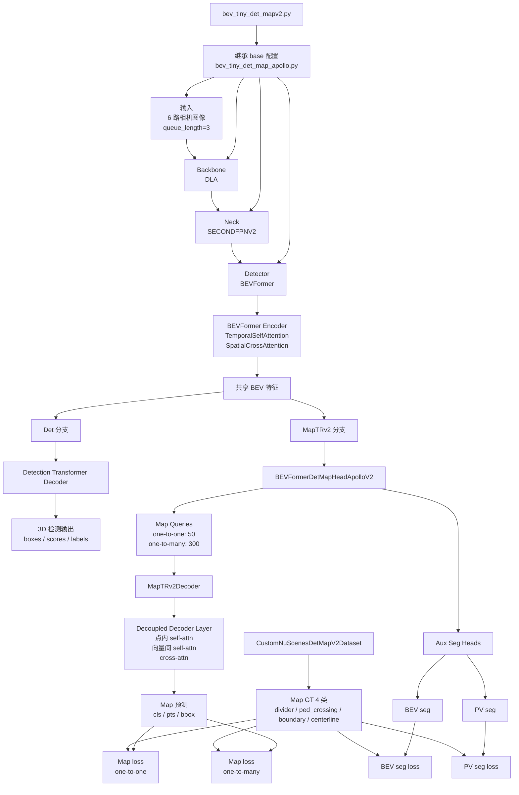

本文面向 Apollo-Vision-Net 当前 det+map 方案，说明 `projects/mmdet3d_plugin/maptrv2` 中引入的 MapTRv2 机制、这些机制在代码里的落地方式，以及它们如何通过 `projects/configs/bevformer/bev_tiny_det_mapv2.py` 接入现有 BEVFormer det+map 基线。

文章只讨论本项目里的实现，不泛化讨论官方 MapTRv2 全部细节。阅读顺序建议为：先看配置变化，再看 `maptrv2` 模块，再回到 dataset 侧理解 4 类地图真值是如何组织的。

## 目录

- [1.设计目标](#section-1-goals)
- [2.模块组织](#section-2-structure)
- [3.配置层变化](#section-3-config)
- [4.MapTRv2 的核心新机制](#section-4-mechanisms)
- [5.Head 里的程序实现](#section-5-head)
- [6.V2 数据集侧的升级](#section-6-dataset)
- [7.bev_tiny_det_mapv2.py 的配置变化总结](#section-7-config-summary)
- [8.与 base det+map 配置的关系](#section-8-base)
- [9.当前实现的边界](#section-9-boundary)
- [10.小结](#section-10-summary)

---

## 结构简图



---

<a id="section-1-goals"></a>
## 1. 设计目标

当前仓库并没有重写整套 BEVFormer 检测链路，而是选择了一个更稳定的工程策略：保留已有 det 分支和大部分 det+map 基础设施，只升级 map 分支到 MapTRv2 风格。这样做有三个直接好处。

第一，检测分支的行为保持不变。`BEVFormer` 主干、det decoder、bbox coder、det loss 以及测试接口都沿用原有实现，MapTRv2 改动集中在 map 头部，风险更可控。

第二，MapTRv2 的增量机制可以逐项叠加。仓库里当前实际接入的 V2 机制主要包括：

- one-to-one / one-to-many 查询拆分
- decoupled decoder layer
- BEV / PV auxiliary segmentation
- 4 类地图协议中的 `centerline`

第三，配置继承关系简单。`bev_tiny_det_mapv2.py` 直接继承 `bev_tiny_det_map_apollo.py`，意味着 V2 配置只需要覆盖真正发生变化的字段，文档和调试都更容易对齐。

<a id="section-2-structure"></a>
## 2. 模块组织

`projects/mmdet3d_plugin/maptrv2` 目录结构很小，说明当前实现是“最小闭环版本”，而不是一个独立大分支：

- `__init__.py`
- `dense_heads/bevformer_det_map_head_apollo_v2.py`
- `modules/decoder.py`

注册入口也很直接：

- `projects/mmdet3d_plugin/maptrv2/__init__.py` 统一导出 `dense_heads` 和 `modules`
- `projects/mmdet3d_plugin/maptrv2/dense_heads/__init__.py` 注册 `BEVFormerDetMapHeadApolloV2`
- `projects/mmdet3d_plugin/maptrv2/modules/__init__.py` 注册 `MapTRv2Decoder` 与 `MapTRv2DecoupledDetrTransformerDecoderLayer`

这意味着 V2 的核心不在于新增一个独立 detector，而是通过 registry 把 map head 和 map decoder 换成 V2 版本。

<a id="section-3-config"></a>
## 3. 配置层变化

`projects/configs/bevformer/bev_tiny_det_mapv2.py` 的作用不是从零定义一个模型，而是在 base 配置上做定点替换。和 `bev_tiny_det_map_apollo.py` 相比，关键变化如下。

### 3.1 地图类别从 3 类扩展到 4 类

V2 配置里定义：

```python
map_classes = ['divider', 'ped_crossing', 'boundary', 'centerline']
```

这一步对应的数据协议升级是：

- `divider`
- `ped_crossing`
- `boundary`
- `centerline`

base 配置里 map 任务只覆盖前三类，而 V2 增加了 `centerline`，因此后面的 head 输出维度和 dataset 也必须一起升级。

### 3.2 map head 从 Apollo 基线版切到 V2 版

配置里将：

```python
type='BEVFormerDetMapHeadApollo'
```

替换为：

```python
type='BEVFormerDetMapHeadApolloV2'
```

这一步是整个 V2 设计的核心开关。之后 one-to-many 查询、辅助分割、V2 decoder 输出拆分，全部都在这个 head 中完成。

### 3.3 查询机制从单一 map query 升级为 one-to-one + one-to-many

配置增加了以下参数：

```python
map_num_vec_one2one = 50
map_num_vec_one2many = 300
map_k_one2many = 6
map_lambda_one2many = 1.0
num_map_vec = map_num_vec_one2one + map_num_vec_one2many
```

其语义是：

- 50 个 one-to-one 查询负责主匹配任务
- 300 个 one-to-many 查询负责增加正样本监督密度
- one-to-many GT 通过重复标签和 polyline 实例构造
- `map_lambda_one2many` 控制该分支损失在总 map loss 中的权重

### 3.4 decoder 从旧版 MapTRDecoder 换成 MapTRv2Decoder

配置里显式删除原有 `map_decoder` 并替换为：

```python
type='MapTRv2Decoder'
type='MapTRv2DecoupledDetrTransformerDecoderLayer'
```

这一步说明 V2 不再沿用单次 self-attention 的 decoder layer，而是引入 decoupled self-attention。

### 3.5 增加辅助分割头

配置中 `map_aux_seg` 打开了三类参数：

- `use_aux_seg=True`
- `bev_seg=True`
- `pv_seg=True`

同时提供了 `loss_weight`、`pos_weight`、`radius` 等超参数。它们会在 head 中生成额外的 BEV/PV segmentation loss，并叠加到 `loss_map` 中。

### 3.6 dataset 切到 V2 版

配置将 train/val/test 的 dataset type 改成：

```python
type='CustomNuScenesDetMapV2Dataset'
```

这是因为 `centerline` 并不是旧版 `CustomNuScenesDetMapDataset` 默认提供的类别；如果不切到 V2 dataset，4 类协议无法成立。

<a id="section-4-mechanisms"></a>
## 4. MapTRv2 的核心新机制

### 4.1 one-to-one 与 one-to-many 查询拆分

在 `BEVFormerDetMapHeadApolloV2.__init__()` 中，head 先记录：

- `map_num_vec_one2one`
- `map_num_vec_one2many`
- `map_k_one2many`
- `map_lambda_one2many`

随后将总查询数改写为：

```python
total_num_map_vec = self.map_num_vec_one2one + self.map_num_vec_one2many
kwargs['num_map_vec'] = int(total_num_map_vec)
```

这说明 V2 版本的 query 总量在 head 初始化阶段就已经确定，不再依赖 base 配置里的单一 `num_map_vec`。

在 forward 阶段，decoder 输出的分类、bbox、点集预测会被 `_split_map_preds()` 切成两组：

- `one2one_preds`
- `one2many_preds`

随后：

- 主 map 输出使用 one-to-one 结果
- one-to-many 结果保存在 `outs['one2many_outs']`
- loss 阶段再单独取出 `one2many_outs` 计算附加监督

对应的损失实现位于 `loss()` 中：

- `_repeat_gt_for_one2many()` 先把 GT 重复 `map_k_one2many` 次
- `self.maptr_loss_head.loss(...)` 计算 one-to-many loss
- 最终生成 `loss_map_o2m_cls`、`loss_map_o2m_pts`、`loss_map_o2m_dir` 等项
- 再通过 `map_lambda_one2many` 缩放并并入 `loss_map`

这个实现方式的特点是：one-to-many 不改动主匹配协议，而是作为额外监督分支叠加进去，工程侵入性比较低。

### 4.2 self-attention decoupling

MapTRv2 的第二个核心变化在 `projects/mmdet3d_plugin/maptrv2/modules/decoder.py`。

`MapTRv2DecoupledDetrTransformerDecoderLayer` 中连续出现两次 `self_attn`，但它们的含义不同。

第一层 self-attention：

- 将 query reshape 成 `(num_vec, num_pts_per_vec, batch, dim)`
- 再按“同一条向量内部的点”进行 attention

第二层 self-attention：

- 将 query 改写成 `(num_pts_per_vec, num_vec, batch, dim)`
- 再按“不同向量之间、相同点位索引”进行 attention

这就是 decoupled 的关键：

- 第一次 self-attention 建模 polyline 内部的点序结构
- 第二次 self-attention 建模向量与向量之间的交互关系

相比旧版把所有点 query 平铺后统一做 self-attention，这种做法更贴近“向量由点组成”的结构先验。

### 4.3 iterative reference refinement

`MapTRv2Decoder` 本身仍然保留了解码器的迭代参考点更新逻辑。

在每个 decoder layer 后：

```python
tmp = reg_branches[lid](output)
new_reference_points = tmp + inverse_sigmoid(reference_points)
reference_points = new_reference_points.sigmoid().detach()
```

这意味着每层 decoder 都会根据上层回归结果细化参考点，从而让后续层在更合理的位置继续预测 polyline 点坐标。

### 4.4 one-to-one / one-to-many 之间的 attention 隔离

`BEVFormerDetMapHeadApolloV2` 中的 `_build_maptrv2_self_attn_mask()` 会构造一个布尔 mask：

- one-to-many 查询不能看 one-to-one 查询
- one-to-one 查询也不能看 one-to-many 查询

这样做的目的，是避免主匹配查询和辅助密集监督查询在 self-attention 中相互干扰。

这一步虽然代码不长，但在工程上非常重要：如果不隔离，one-to-many 查询会直接污染主分支特征，导致训练行为难以解释。

<a id="section-5-head"></a>
## 5. Head 里的程序实现

### 5.1 V2 head 继承策略

`BEVFormerDetMapHeadApolloV2` 不是完全重写，而是继承自：

```python
class BEVFormerDetMapHeadApolloV2(BEVFormerDetMapHeadApollo)
```

这意味着：

- det 分支逻辑延续基类
- map 的大量基础损失、点归一化、评测接口也复用基类
- V2 只覆盖那些必须替换的部件

这种设计降低了 V2 接入成本，也解释了为什么当前 V2 文件数量非常少。

### 5.2 forward 中的 map 分支执行路径

forward 逻辑可以概括为四步。

第一步，先调用 `BEVFormerHead.forward(...)` 得到通用 det 输出和 `bev_embed`。

第二步，若 map 分支开启，则用 map query 和 `bev_embed` 进入 `map_decoder`，生成每层 decoder 的：

- `all_cls`
- `all_pts01`
- `all_bbox01`

第三步，调用 `_split_map_preds()` 拆成 one-to-one 与 one-to-many 两组。

第四步，如果打开了 `map_aux_seg`，则额外生成：

- `outs['map_seg']`
- `outs['map_pv_seg']`

因此当前 V2 head 的输出不仅有最终 polyline 预测，还有训练辅助分支需要的分割 logits。

### 5.3 辅助分割的实现方式

V2 head 提供两种 auxiliary segmentation：

- BEV segmentation
- PV segmentation

实现方式不是引入复杂大网络，而是各自用一个轻量 `Conv -> ReLU -> Conv` 头：

- `map_seg_head`
- `map_pv_seg_head`

监督信号也不是来自额外标注文件，而是由已有的 `gt_map_vecs_pts_loc` 在线投影得到：

- `_build_bev_seg_targets()` 负责将 polyline rasterize 到 BEV mask
- `_build_pv_seg_targets()` 负责将 polyline 投影到各 camera 平面生成 PV mask

最终损失项为：

- `loss_map_seg`
- `loss_map_pv_seg`

它们会再并入总的 `loss_map`。

从工程角度看，这个设计有两个优点：

- 不需要离线准备额外 segmentation GT
- 可以直接利用已有矢量 GT 产生更稠密的监督

<a id="section-6-dataset"></a>
## 6. V2 数据集侧的升级

MapTRv2 在本项目里不仅是 head 升级，也是 GT 协议升级。因此 `CustomNuScenesDetMapV2Dataset` 和 `VectorizedLocalMapV2` 是必要组成部分。

### 6.1 4 类标签映射

`VectorizedLocalMapV2.CLASS2LABEL` 定义为：

- `road_divider` / `lane_divider` -> 0
- `ped_crossing` -> 1
- `contours` -> 2
- `centerline` -> 3

这里的 `contours` 对应配置里的 `boundary`，本质上仍然来自 `road_segment` 和 `lane` 轮廓。

### 6.2 centerline 的生成方式

`centerline` 不是 nuScenes 现成直接给出的单独图层，而是从：

- `lane`
- `lane_connector`

中离散化中心线，再根据：

- `incoming_tokens`
- `outgoing_tokens`

构造有向图，最后通过 `networkx` 把相邻 lane 中心线串接起来。

这个实现位于：

- `_get_centerline()`
- `union_centerline()`

其结果是，V2 dataset 不只是“多一个类别”，而是引入了一套新的拓扑合并逻辑。

### 6.3 为什么 V2 dataset 必须单独定义

因为 base dataset 的 3 类 map GT 只需要：

- divider
- ped_crossing
- boundary

而 centerline 需要额外的图结构后处理。把这部分逻辑塞回旧 dataset 会让基线版本和 V2 版本耦合过深，因此本项目把它拆成了单独的 V2 dataset。

<a id="section-7-config-summary"></a>
## 7. `bev_tiny_det_mapv2.py` 的配置变化总结

从工程使用角度，可以把这个配置文件理解成“MapTRv2 适配层”。它真正改变的只有下面几类内容。

### 7.1 输出协议变化

- map 类别从 3 类变成 4 类
- 输出查询从单一 map query 变成 one-to-one + one-to-many

### 7.2 结构变化

- map head 切到 `BEVFormerDetMapHeadApolloV2`
- map decoder 切到 `MapTRv2Decoder`
- decoder layer 切到 `MapTRv2DecoupledDetrTransformerDecoderLayer`

### 7.3 监督变化

- 增加 `map_aux_seg`
- 增加 one-to-many loss

### 7.4 数据协议变化

- dataset 切到 `CustomNuScenesDetMapV2Dataset`
- map GT 从 3 类升级为 4 类，新增 centerline

换句话说，`bev_tiny_det_mapv2.py` 的设计重点不是“改 backbone”，而是“只升级 map 分支协议和监督机制”。这也是当前实现能够较稳定地接入已有 BEVFormer det+map 框架的原因。

<a id="section-8-base"></a>
## 8. 与 base det+map 配置的关系

`bev_tiny_det_map_apollo.py` 仍然是当前 V2 配置的底座，它提供了以下不会被 V2 重写的部分：

- BEVFormer detector 主体
- DLA backbone + SECONDFPNV2 neck
- det decoder 与 det loss
- camera-only 输入方式
- temporal queue 机制
- det+map 的基础 pipeline

V2 文件只覆盖 map 分支最关键的升级项。这种继承关系让我们在排查问题时可以遵循一个清晰原则：

- 如果问题发生在检测分支，大概率先看 base 配置和原 det+map head
- 如果问题发生在 map one-to-many、aux seg、centerline，上来就看 `maptrv2` 目录和 V2 dataset

<a id="section-9-boundary"></a>
## 9. 当前实现的边界

本项目里的 MapTRv2 实现已经能完整跑通 det+mapv2 训练，但它仍然是一个“面向当前工程闭环”的版本，而不是官方实现的逐行镜像。当前边界主要有三点。

第一，detector 主体仍然是 BEVFormer 架构，MapTRv2 只改 map head，而不是重新定义整套感知框架。

第二，辅助分割是轻量化实现，重点在于提供额外监督，而不是引入更复杂的 segmentation 子网。

第三，dataset 侧的 centerline 构造使用了当前工程里可维护的 topology merge 方案，它和官方实现思路一致，但不追求完全相同的程序组织形式。

<a id="section-10-summary"></a>
## 10. 小结

Apollo-Vision-Net 里的 MapTRv2 设计可以概括为一句话：在保留 BEVFormer det+map 主干稳定性的前提下，把 map 分支升级为 V2 风格的查询组织、解码方式、辅助监督和 4 类 GT 协议。

如果从代码入口来记忆，最重要的几个文件如下：

- `projects/mmdet3d_plugin/maptrv2/dense_heads/bevformer_det_map_head_apollo_v2.py`
- `projects/mmdet3d_plugin/maptrv2/modules/decoder.py`
- `projects/mmdet3d_plugin/datasets/nuscenes_det_mapv2_dataset.py`
- `projects/configs/bevformer/bev_tiny_det_mapv2.py`

阅读顺序建议是：先看配置，再看 head 的 forward/loss，再看 decoder 的 decoupled attention，最后回到 dataset 理解 centerline GT 生成。这样最容易把“V2 机制”和“本工程实现”对齐起来。